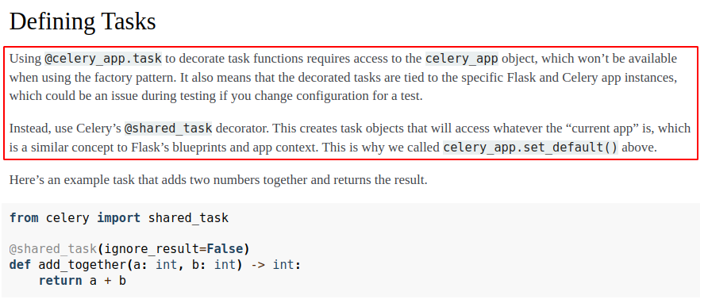

# celery docs:
https://viblo.asia/p/tim-hieu-ve-celery-1VgZv4dr5Aw <br>
https://docs.celeryq.dev/en/v5.3.6/getting-started/first-steps-with-celery.html#first-steps <br>
https://awstip.com/do-background-job-using-django-celery-5aae1b3e8a3a <br>
https://medium.com/the-andela-way/create-a-simple-microservice-with-celery-python-flask-redis-to-send-emails-with-gmail-api-224cc74ac7b3 <br>


# celery docs for flask only:
https://flask.palletsprojects.com/en/3.0.x/patterns/celery/

# step to install:
### 1. install redis or rabbitMQ (in this tutorial, we use redis)
https://www.digitalocean.com/community/tutorials/how-to-install-and-secure-redis-on-ubuntu-20-04

### 2. install environment:
```
cd project_name

python3 -m venv venv

source venv/bin/activate

pip install -r requirements.txt
```

### 3. run flask server
`python3 dev.py`

### 4. run celery worker
open another terminal and run:<br>
`celery -A services.celery_app worker --loglevel=DEBUG`

### 5. test the result
now go to http://127.0.0.1:5000/<br>
check on terminal of worker, we will see the result showing in there.

# Notes:
normally, we will use `@celery.task()`, but with this repo, we are using `celery for flask`, so we will use `shared_task()` instead.<br>
the reason is:


# Handle exception (auto retry):
https://coderbook.com/@marcus/how-to-automatically-retry-failed-tasks-with-celery/

### there's 2 types of error:<br>
1. Connection issues with the broker and Message Queue.
2. Exceptions raised on the worker.

### with the first type, we will use this:
```
from tasks.celery import app

app.send_task(
    "foo.task",
    retry=True,
    retry_policy=dict(
        max_retries=3,
        interval_start=3,
        interval_step=1,
        interval_max=6
    )
)
```
### meaning: 
- if the connection fails and we cannot send the message to the message queue, we will attempt to retry 3 times. The first retry will happen at `interval_start` seconds, meaning 3 seconds. Then each additional failure will wait for another `interval_step` 1 second until it attempts to send the message again. Not sure what `interval_max`=6 mean.

### with the second type, we will use this:
```
import logging
from tasks.celery import app

logger = logging.getLogger(__name__)

@app.task(name="foo.task", bind=True, max_retries=3)
def foo_task(self):
    try:
        execute_something()
    except Exception as ex:
        logger.exception(ex)
        self.retry(countdown=3**self.request.retries)
```
### the reason why second type occur:
- The reason why a task might fail is usually that a crash happened on the worker and an Exception was raised. Perhaps there is a bug in the code, some service timed out or it was too high demand.
### meaning:
- `bind=True` gives us access to the self keyword argument.<br>
- `max_retries` defines the maximum times that this task can be re-executed using the `self.retry()` method.<br>
- Whenever we catch an exception that we do not re-raise and silence, we want to make sure that we log the error using the `logger.exception()` method which will include the full traceback.<br>
- `self.retry()` will retry the task. The countdown kwarg defines how many seconds we should wait before we retry again. Note that we define it as an exponential value that gets increased by each retry.<br>

# Redis Cluster mode

### Purpose:
The reason why this branch exists is because we need to find the way to fix this bug:<br>
`crossslot keys in request don't hash to the same slot aws celery` <br>
It's orcur when trying to use this techstack:
- Celery as Worker
- AWS ElastiCache - Redis as Message Broker

I'm trying to fix it based on this package, but it doesn't work:<br>
https://github.com/hbasria/celery-redis-cluster-backend

### Steps:
- Create 6 redis nodes and redis cluster using those 6 nodes.<br>
- redis 1-3 will be the master nodes, redis 4-6 will be the slave nodes (this is maybe because of redis 1-3 having `exposed ports` where 4-6 don't).<br>
- Setting up for the `celery_redis_cluster_backend` package.

    add:
    ```
    CELERY_REDIS_CLUSTER_SETTINGS = { 'startup_nodes': [
        {"host": "redis1", "port": "6390"},
        {"host": "redis2", "port": "6391"},
        {"host": "redis3", "port": "6392"}
    ]}
    ```
- Try to connect to the redis cluster from the celery worker.<br>

### Result:

Return Error:<br>
`ResponseError('CLUSTERDOWN The cluster is down')` or `redis.exceptions.ResponseError: MOVED 192.168.80.7:6379`

### What has been change:
- `docker-compose.yml`
- `.env`
- folder `celery_redis_cluster_backend`
- `services/__init__.py`
- `redis.conf`
- `requirements.txt`